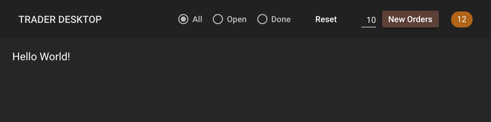

Exercise 2: Header
==================
In this exercise we will build the header of our trade blotter. We will use Material-UI to style the header exactly as shown below. None of the controls will function yet. We will get them working in subsequent exercises. For now, we will only focus on styling. Remember to look at the [assets folder](../assets/trader-desktop-design-spec) for a detailed specification of the visual design.



Exercise
--------
We will start with an off-the-shelf starter project that uses our preferred technology stack. We will continue to build upon this project in the following exercises until the entire blotter is working.

Clone the starter project from [react-mobx-mui-ts-monorepo](https://github.com/nareshbhatia/react-mobx-mui-ts-monorepo). Rename your local copy as `trader-desktop`. The starter project contains two packages:
- `shared` is expected to contain reusable code such as domain objects, stores and UI components.
- `myapp` is expected to contain the final app. It is responsible for composing the components in `shared` into pages and providing routing functionality to navigate between them. The pages will use stores created in `shared` to pull in data from the server.

There are three README.md files in the monorepo. Use the instructions in these files to build the shared library and the main app. Get intimately familiar with all the commands described in these files - these will help you with your blotter implementation going forward.

The `shared` folder already contains a starter implementation of the header component. We will enhance it step-by-step to make it look like the one in the design above. Use Storybook to build the header as a standalone component. Don't rush to test it in the main app yet. Follow the steps below to implement the header:

- While we will use CSS-in-JS to encapsulate our styles inside our components, we still have to set some global defaults, e.g. the background color of our app, the default font color etc. For now, we will have to set these global defaults for Storybook. Later we will do the same for the main app. The global css for Storybook is saved in `shared/.storybook/preview-head.html`. Adjust the background color and text color to match the design (`#262626` and `#ffffff` respectively).
- Edit `shared/src/components/test-support/get-test-theme.ts`. Set the background color of the theme to `#262626`. Refer to [Material-UI docs](https://material-ui-next.com/customization/default-theme/) to find out where the default background color is set. (Hint: look under palette).
- Edit `header.tsx` to inject styles using the withStyles HOC. Refer to the [Material-UI docs](https://material-ui-next.com/guides/typescript/) to understand how to do this with TypeScript. Here's a quick start showing how to do this for the toolbar height and title:

```typescript jsx
import * as React from 'react';

import AppBar from 'material-ui/AppBar';
import {
    StyledComponentProps,
    WithStyles,
    withStyles
} from 'material-ui/styles';
import { Theme } from 'material-ui/styles/createMuiTheme';
import Toolbar from 'material-ui/Toolbar';

const styles = (theme: Theme) => ({
    toolbar: {
        minHeight: 50
    },
    title: {
        color: theme.palette.grey[300],
        fontSize: 13,
        fontWeight: theme.typography.fontWeightMedium,
        flex: 1
    }
});

const decorate = withStyles(styles);

export interface HeaderProps {
    children?: any;
}

export const Header = decorate<HeaderProps>(
    class extends React.Component<
        HeaderProps &
            WithStyles<'toolbar' | 'title'>
    > {
        render() {
            const { classes, children } = this.props;

            return (
                <AppBar position="static" elevation={0} color="default">
                    <Toolbar className={classes.toolbar}>
                        <h1 className={classes.title}>{children}</h1>
                    </Toolbar>
                </AppBar>
            );
        }
    }
);
```

- Now add the visibility selector radio buttons (All, Open & Done). You may have a tendency to add the three buttons right inside the header. However note that this would require you to add all the related logic in the header, making it unnecessarily complicated and doing too much. Simplify the header code by breaking the `VisibilitySelector` into a separate component in a separate file `visibility-selector.tsx`. The only code in your header should be something like the code below. Note that the component will later be wired to a MobX store, called `orderStore`, but you don't have to worry about it yet.

```typescript jsx
<VisibilitySelector
    visibilityFilter={orderStore.filter}
    onVisibilityChanged={orderStore.setFilter}
/>
```

- Use an enumeration to define the three potential values of the visibility filter. This will help you strongly type the filter values. Create the following enumeration in `src/domain/types.ts`. Note that we will use the `domain` directory to specify all our domain concepts (e.g. `Orders`) as well as the common visual concepts (e.g. visibility filter values). These will generally be pure TypeScript files (*.ts) - not presentational components. 

```typescript jsx
export enum VisibilityFilter {
    ALL = 'ALL',
    OPEN = 'OPEN',
    DONE = 'DONE'
}
```

- Refer to the [Radio Buttons](https://material-ui-next.com/demos/selection-controls/#radio-buttons) documentation to implement the buttons in your `VisibilitySelector`. You may find that the standard radio button is hard to style to our design. Take a look at the smaller version that is created using `icon` and `checkedIcon`. Take the idea of creating simpler components further - create a component called `MiniRadio` that uses icons to style the buttons to our spec. Create it at `src/components/basics/mini-radio.tsx`. Use these mini radios in your `VisibilitySelector`.
- Next add the Reset button to the header. Use the Material-UI button. Override the styling of all buttons to match our design. This can be done in `components/test-support/get-test-theme.ts`. You can read more about it in [Material-UI docs](https://material-ui-next.com/customization/overrides/).
- Next add the new orders input and the New Orders button. Again, create a separate component for this - call it `NewOrders` and create it in a file called `new-orders.tsx`.
  - Use the Material-UI `Input` component to get the number of orders. Use a property named `numOrdersToCreate` to pass in the value of the number of orders to create. Note that I am using a reasonably long name for this property. It is a best practice to name variables and properties so that people reading the code can understand their purpose. Don't use short and cryptic names that make it hard to understand your intent. Similarly the change event sent back to the parent should be called `onNumOrdersToCreateChanged`.
  - Use `color="primary"` to color the button brown. This means you have to set the primary color for all of your application. Let's set both the primary and secondary colors in our theme. Go to `components/test-support/get-test-theme.ts` and set primary to `brown[700]` and secondary to `orange.A400`. These will go well with our design.
- Finally add the number of orders indicator to the header.
- Make sure that the header test still works after all your changes to the header (`header.test.tsx`).

Once you have fully styled your header, take a look at it in your application. To do this, build the `shared` library (`yarn build`) and then rebuild the app (`cd ../myapp; yarn start`). Note that you will have to update the global styles for the app to match the design (background color etc.). The global styles are in `myapp/src/shell.tsx` (starting with `@global`). Note that they are driven using the theme. So as long as you have set the theme correctly, you will not have to change anything!

Tips
----
- Run lint and prettier on your code frequently, especially before committing your code.
- Use descriptive names for your variables, properties, functions, etc. Make sure the intent of the element is clear by reading its name. Always remember the famous quote by Phil Karlton: "There are only two hard things in Computer Science: cache invalidation and naming things".
- We use the prefix `on` to define events and the prefix `handle` to define event handlers. For example, `onNumOrdersToCreateChanged` is an event, whereas `handleNumOrdersToCreateChanged` is an event handler.

Resources
---------
- [CSS in JS](http://blog.vjeux.com/2014/javascript/react-css-in-js-nationjs.html) - This is the talk by Facebook's Christopher Chedeau that started the CSS-in-JS movement. Look at the speaker deck first and then watch the video. 
- [Material-UI](https://material-ui-next.com/) - Material-UI is an implementation of Google's popular design system called [Material Design](https://material.io/guidelines/). Although our trade blotter does not follow Material Design, using Material-UI is still beneficial for its robust CSS-in-JS implementation.
- [The definitive guide to React Material](https://blog.logrocket.com/the-definitive-guide-to-react-material-d730c8a3e8ba) - A quick introduction to the Material-UI API.
- [Sharing UI Components with Lerna and Yarn Workspaces](https://medium.com/@NareshBhatia/sharing-ui-components-with-lerna-and-yarn-workspaces-be1ebca06efe) - A high-level overview of Lerna and Yarn Workspaces and why you would use them.
- [Lerna](https://github.com/lerna/lerna)
- [Yarn Workspaces](https://yarnpkg.com/lang/en/docs/workspaces/)
- [Storybook](https://storybook.js.org/basics/introduction/) - Storybook is a development environment for UI components. With it, you can visualize different states of your UI components and develop them interactively. Since Storybook runs outside of your app, you can develop UI components in isolation without worrying about app specific dependencies and requirements.
